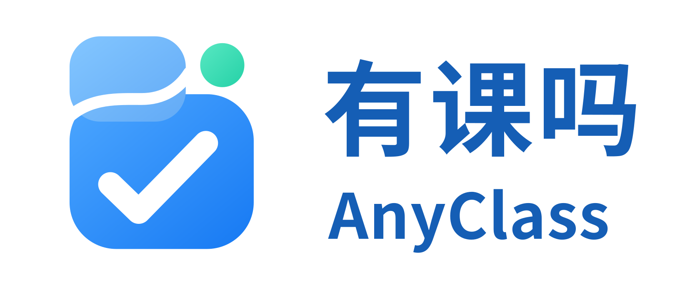

<h1>AnyClass / 有课吗</h1>

<strong>今天有课吗？打开就知道。</strong>

  <a href="https://anyclass.heyaaron.asia/"><strong>在线使用</strong></a>
  ·
  <a href="#功能">功能</a>
  ·
  <a href="#兼容性">兼容性</a>
  ·
  <a href="#roadmap">Roadmap</a>

  
  
  
  

  简体中文 | <a href="README.en.md">English</a>

---

**AnyClass（有课吗）** 是一个面向学生的 Local-first 课程表工具。它帮助你快速查看今天的课程、浏览周课表、导入课程、管理多个课表，并将课表导出到系统日历。

**在线使用：** https://anyclass.heyaaron.asia/

> 线上 Hosted Production 当前为 **v0.2.1**。GitHub 已正式发布 [**v0.2.0**](https://github.com/heyaaron-Wu/AnyClass/releases/tag/v0.2.0) 源码 Release。当前仓库 `main` 包含已对齐的 **v0.2.1 公开源码基线**；v0.2.1 源码 Release 尚未发布。源码 Release 身份与 Hosted Production 的部署 Build 身份相互独立。

## 功能

- 今日课程与当前 / 下一节课程
- 周课表
- 多课表管理与当前课表切换
- 课程编辑与本地课表信息编辑
- 统一导入预览（Unified Preview）
- 教务系统 / Bookmark / 文件 / 剪贴板 / AI 辅助导入流程
- 当前选中课表作为默认导入目标
- 重复课程与冲突检查
- Apple 日历 / iCalendar（ICS）导出
- 课程提醒
- 节次与显示范围设置
- Local-first：课表数据默认保存在当前设备

## 导入说明

AnyClass v0.2.0 的导入流程以 **Course 课程数据** 为核心：

- 导入结果会先进入统一预览，再由用户确认保存。
- 当前选中的课表是默认导入目标，不会仅凭来源信息静默切换到其他课表。
- 通用导入不会为了通过校验而伪造学校 ID。
- 缺失学校名称等必要信息时，会在保存前要求用户确认或补充。
- AI 辅助导入只负责整理为 AnyClass 课程数据，不直接创建系统日历事件。
- **ICS 导入已移除；ICS 导出保留。**

## 隐私

AnyClass 采用 **Local-first** 设计。

- 课表数据默认保存在当前设备的浏览器中。
- 当前产品不会将课表数据上传到 AnyClass 服务器。
- AnyClass 不要求保存你的学校账号密码。
- 当前导入流程不会上传你的 Cookie、Session 或身份验证 Token。

更多信息见 [PRIVACY.md](PRIVACY.md)。

## 兼容性

| 教务系统 | 状态 |
| --- | --- |
| 正方教务 V9 | ✅ 已验证 |
| 强智教务 | 未支持 |
| 青果教务 | 未支持 |
| URP | 未支持 |
| 金智教务 | 未支持 |

“已验证”表示已完成真实环境导入验证。公开项目说明不使用具体学校作为兼容性宣传。

## Apple 日历

AnyClass 当前保留 **ICS 导出**。

在 iPhone 或 iPad 上，可将 AnyClass 导出的 ICS 文件交给系统日历导入；AnyClass 不再提供 ICS 文件反向导入到课表的功能。

## Roadmap

计划中的方向包括：

- 更多教务系统 Adapter
- Android 日历体验
- 调课 / 补课
- 考试安排
- Calendar Subscription
- 更完整的多学期管理
- 校园地图 / 教室导航等学生工具能力

Roadmap 中的内容属于规划，并不代表当前版本已经提供。

## 开源状态

**AnyClass v0.2.0 的公开源码 Release 已经发布：** [AnyClass v0.2.0](https://github.com/heyaaron-Wu/AnyClass/releases/tag/v0.2.0)

**AnyClass v0.2.1 已部署到线上 Production；对应 GitHub 源码 Release 尚未发布。**

普通用户推荐直接使用 [AnyClass 在线版](https://anyclass.heyaaron.asia/)；本仓库主要用于查看源码、问题反馈、兼容性适配与开发协作。

> **仓库源码状态：** 当前 `main` 包含已对齐的 AnyClass v0.2.1 公开源码基线。GitHub v0.2.0 源码 Release 已发布；v0.2.1 源码 Release 尚未发布。源码身份为 `v0.2.1`，Hosted Production 使用独立的部署 Build 身份。

## 贡献

请阅读 [CONTRIBUTING.md](CONTRIBUTING.md)。

请勿在 Issue 或 Pull Request 中提交学校账号密码、Cookie、Session、身份验证 Token 或私人学生数据。

## 安全

请阅读 [SECURITY.md](SECURITY.md)。

## License

[Apache-2.0](LICENSE) · Copyright 2026 Aaron
